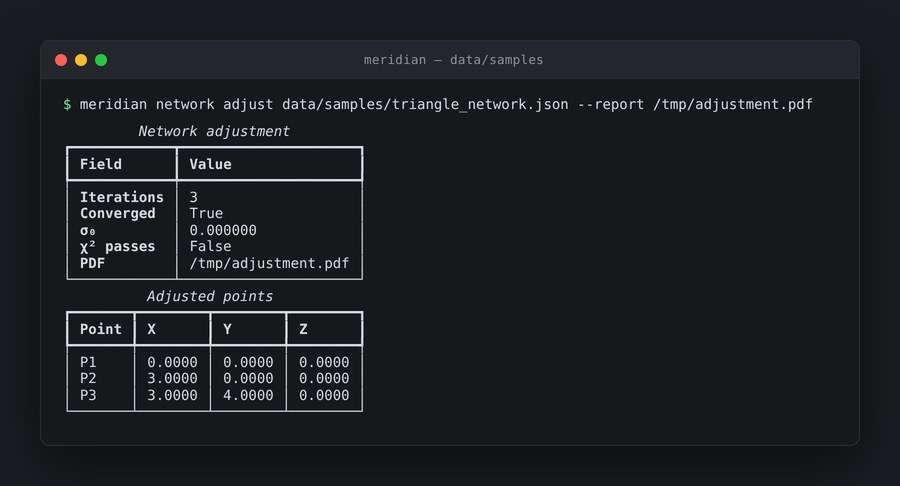
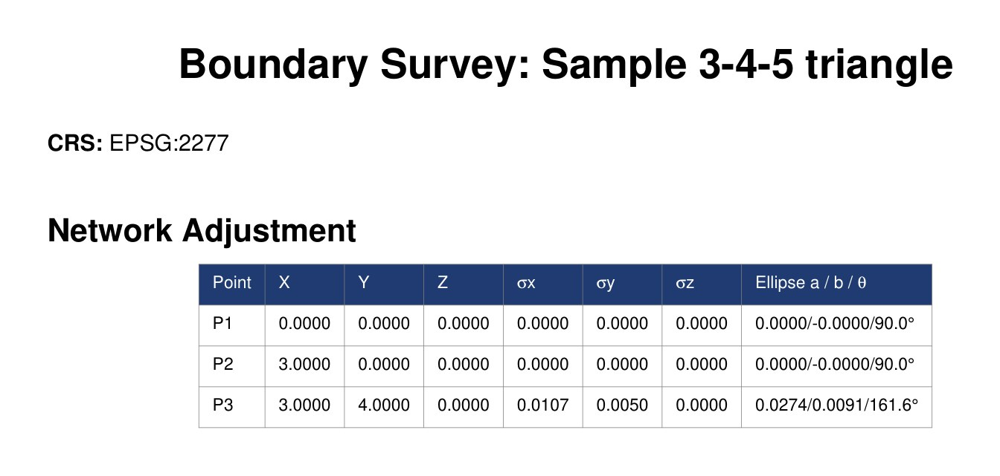

# Meridian


**A professional surveying suite — real geodetic math, hexagonal architecture, plugin-first.**

[](LICENSE)
[](https://www.python.org/)
[](tests/)
[](https://hypothesis.readthedocs.io/)

## Project status

> **Actively developed, pre-1.0. Not production survey software.** This is a personal project built in the open, published so the
> work can be read and run. It is not a supported product.

Known gaps and caveats, stated up front:

- Not validated against a certified reference dataset; no licensed surveyor has signed off on its output.
- Deed parsing is assistive. Every parsed description needs human review.
- Do not use it to produce a sealed deliverable without independent verification.

Issues and pull requests are welcome. If something breaks on first run, that is
useful information — please open an issue rather than assuming it works for
everyone else.


## Screenshots

Real output from a local run against the bundled sample network — no mockups.



*A least-squares network adjustment on the bundled 3-4-5 triangle. P3 enters with an
a-priori guess of (2.9, 3.9) and the Gauss-Newton solve pulls it to exactly (3.0000,
4.0000) in three iterations. The interesting row is **χ² passes: False** — with three
distance observations and zero residuals, σ₀ comes out at exactly 0, and the two-sided
χ² test at α = 0.05 rejects that as implausibly good rather than reporting a pass. The
global test is genuinely applied, not decorative.*



*The `--report` flag writes a PDF with the part that matters to a surveyor: posterior
standard deviations and a 2σ horizontal error ellipse per point. The two fixed brass
disks carry zero uncertainty; the set iron pin gets σx 0.0107, σy 0.0050, and an ellipse
of 0.0274 / 0.0091 m oriented at 161.6° — derived from the propagated covariance matrix,
not assumed.*

> *Where every line is true.*

Meridian takes survey observations — total station, GNSS, lidar, deed text — and
carries them through rigorous coordinate geometry, least-squares network
adjustment, and boundary reconciliation to CAD and GIS deliverables.

It is built around a single canonical data model (`Point`, `Observation`,
`Parcel`, `Survey`) and a strict hexagonal architecture: **the domain core
performs no I/O.** Every instrument format, exporter, and jurisdiction template
is an adapter or a plugin around that core.

```
29,908 LOC   ·   523 tests   ·   8 property-based invariants   ·   7 adapter families
```

---

## Why this is not a wrapper

The math is real, and it is the point.

| Module | What it does |
|---|---|
| `math/adjustment.py` | Least-squares network adjustment with covariance matrices and error ellipses (`scipy.linalg`) |
| `math/cogo.py` | Coordinate geometry — traverse, intersection, curve solving |
| `math/geodetic.py` | Geodesic distance and azimuth on the ellipsoid |
| `math/transforms.py` | NAD27 ↔ NAD83 ↔ WGS84 via NADCON5, HARN, GEOID18, VDatum (`pyproj` + grids); State Plane and UTM with correct zone selection |
| `math/triangulation.py` | Delaunay TIN, contour extraction, breakline support (`scipy.spatial`) |
| `math/statistics.py` | Closure statistics, blunder detection, residual analysis |

A traverse that closes is not evidence of correctness. An adjustment that
distributes error according to observation weights and reports the resulting
covariance is. That distinction is why this project exists.

## Architecture

```
                       ┌────────────────────────────────┐
                       │         domain core             │
     adapters ────────►│  Point · Observation · Parcel   │◄──────── plugins
     (all I/O)         │  Survey                         │   instruments,
                       │  math/  — zero I/O              │   exporters,
                       └────────────────────────────────┘   jurisdictions
        │                                                          │
   ┌────┴──────┬──────────┬───────────┬──────────┬─────────┐      │
   ▼           ▼          ▼           ▼          ▼         ▼      ▼
instruments   cad        gis     pointcloud    ocr    persistence  reports
Leica GSI    ezdxf     fiona       laspy      OCR +   sqlalchemy  reportlab
Trimble JXL  DXF       geopandas   PDAL       LLM     alembic     jinja2
Sokkia SDR   LandXML   GeoPackage  LAS/LAZ    recon.
TDS RW5                GeoJSON     COPC
Nikon RAW              KML
```

Swap the database, the desktop UI, or the file format without touching the math.
That is the promise of hexagonal architecture, and here it is actually enforced —
the domain layer imports nothing that performs I/O.

## Capabilities

| Area | Coverage |
|---|---|
| **Field-to-finish** | Total-station raw data → COGO traverse → least-squares adjustment → CAD deliverables |
| **GNSS** | RINEX import, baseline processing, NTRIP streams, RTK/PPK, network adjustment with covariance |
| **Lidar** | LAS/LAZ ingest, ground classification, TIN-from-cloud, contours, COPC streaming |
| **Deeds** | Metes-and-bounds parser (regex + LLM consensus), PLSS, less-and-except clauses, chain of title, deed comparison |
| **Boundary** | Evidence weighting, monument retracement, gap/overlap detection, parcel fabric topology |
| **Geodesy** | NADCON5, HARN, GEOID18, VDatum; State Plane and UTM |
| **Reports** | PDF via ReportLab, jurisdiction-specific certificates, closure reports, error-ellipse plots |

## Property-based testing

Geometric code has invariants that example-based tests miss. Meridian asserts
them directly with Hypothesis (`tests/test_properties.py`, 8 `@given`
properties) — round-trip transforms return the original coordinate within
tolerance, traverse closure is invariant under choice of starting point, and so
on. Hypothesis generates the adversarial inputs so you don't have to guess them.

## Layout

| Path | Contents |
|---|---|
| `src/meridian/math/` | the geodetic and adjustment core |
| `src/meridian/adapters/` | instruments, cad, gis, pointcloud, ocr, persistence, reports |
| `src/meridian/pipelines/` | field-to-finish orchestration |
| `src/meridian/jurisdictions/` | per-jurisdiction rules and certificate templates |
| `src/meridian/plugins/` | plugin loader and registry |
| `src/meridian/api/` | FastAPI service layer |
| `src/meridian_desktop/` | PySide6 desktop application |
| `tests/` | 523 tests across 18 suites |

## Running it

```bash
pip install -e ".[desktop]"
make test         # 523 tests
make lint
meridian --help   # Typer CLI
```

Core dependencies: numpy, scipy, shapely, pyproj, ezdxf, fiona, geopandas,
laspy, sqlalchemy, fastapi, reportlab.

## Status and honest limitations

Meridian is **pre-1.0 and is not production survey software.** Specifically:

- It has not been validated against a certified reference dataset, and no
  licensed surveyor has signed off on its output.
- Deed parsing uses regex + LLM consensus. It is assistive. Every parsed
  description requires human review before use.
- Adapter completeness varies; instrument coverage is broadest for the formats
  listed above.
- Do not use it to produce a sealed deliverable without independent verification.

The math is sound and tested. The professional accountability layer that
separates *correct* from *certifiable* is a different and much longer road.

## License

MIT — see [LICENSE](LICENSE).
